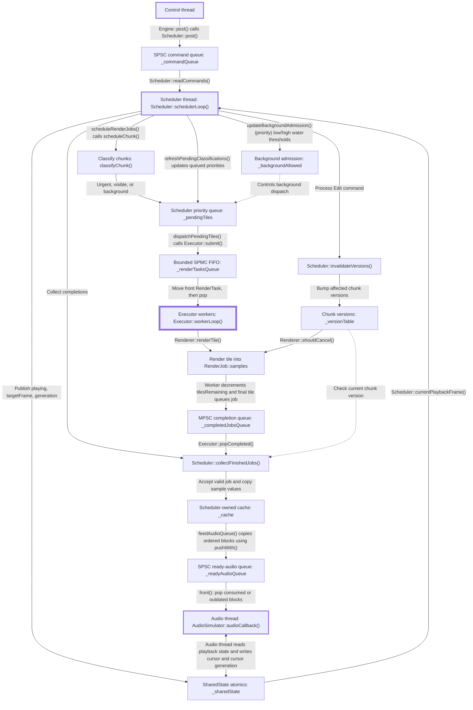

# ANASA - Asynchronous Neural Audio Scheduling Architecture

> Work in progress

A C++ experimental prototype for studying how to schedule computationally expensive audio rendering ahead of playback on a finite audio timeline. It supports DAW-style controls such as play, pause, seek, region edits, and viewport changes.

The prototype uses a simulated periodic audio-device callback. It is not an audio host, plugin, or complete DAW.

The current renderer generates deterministic synthetic audio and artificial CPU load. **It does not yet perform neural inference.**

The problem statement is the following:

Given limited rendering capacity and moving playback deadlines, which work should be rendered first to minimize active-playback underruns and interruption latency while supporting seeks, edits, viewport changes, and background preparation?

The project separates that problem into smaller components:

- A deterministic synthetic renderer that turns timeline tiles into synthetic samples.
- A fixed worker pool that performs render work concurrently.
- A scheduler that classifies, orders, caches, and publishes rendered work.
- Lock-free Single-producer/single-consumer (SPSC) queues. They store commands and ready for consumption audio blocks.
- A simulated audio-device thread that consumes exact blocks and records underruns.
- An `Engine` that owns the complete pipeline and enforces its lifecycle.

Two scheduling strategies are implemented: FIFO ordering by tile submission sequence and deadline-aware priority ordering. Both modes classify work as urgent, visible, or background, and classification affects pending-queue capacity limits. Priority mode also uses low/high water thresholds to gate background dispatch while playback is requested.

## Architecture

ANASA is divided into small **CMake targets** with one-directional dependencies.

### Runtime communication

The diagram shows how commands, rendering work, and audio move between runtime threads. Scheduler coordinates the pipeline. Executor workers render tiles concurrently. AudioSimulator consumes published audio independently. Thicker borders identify threads. The heavier border identifies the Executor worker pool.

- **Command handling:** The control thread posts commands through `_commandQueue`. Scheduler processes them to update playback, viewport, and content state.
- **Work selection:** Scheduler classifies chunks as urgent, visible, or background and places their tiles in `_pendingTiles`. It refreshes classifications when playback or viewport changes require it. In Priority mode, low/high water thresholds control background dispatch while playback is requested.
- **Parallel rendering:** Selected tiles enter the bounded `_renderTasksQueue`. Workers take tasks and render separate regions of a shared `RenderJob::samples` buffer. Once all tile tasks have been accounted for, the final task places the job in `_completedJobsQueue`, even if rendering was cancelled. Jobs abandoned during shutdown may never produce a completion.
- **Completion and publication:** `collectFinishedJobs()` checks job identity, cancellation, and version before copying accepted samples into `_cache`. `feedAudioQueue()` copies cached samples into `_readyAudioQueue` as generation-tagged blocks in timeline order.
- **Audio consumption:** AudioSimulator consumes blocks matching its current generation and expected position, discards outdated blocks, and reports playback progress through `_sharedState`. During active playback, a missing required block records an underrun and advances the simulated cursor through conceptual silence.
- **Transport and invalidation:** Shared atomics communicate playback state, seek targets, generations, and cursor acknowledgements. Edits bump affected chunk versions so Renderer can abandon obsolete work and Scheduler can reject obsolete results.

Rendering may finish out of order, but audio publication remains ordered. Chunk versions identify valid content. Playback generations distinguish audio belonging to different playback sequences.