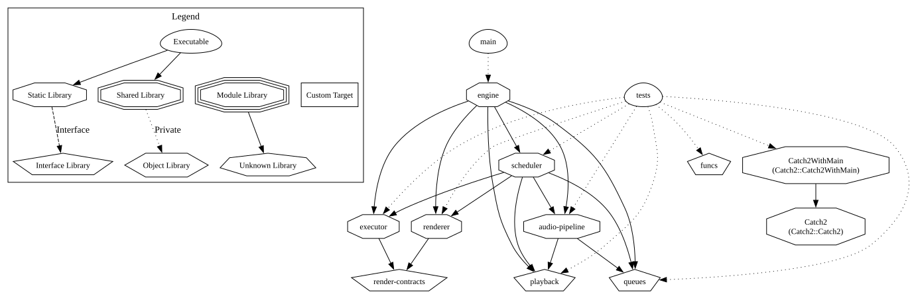
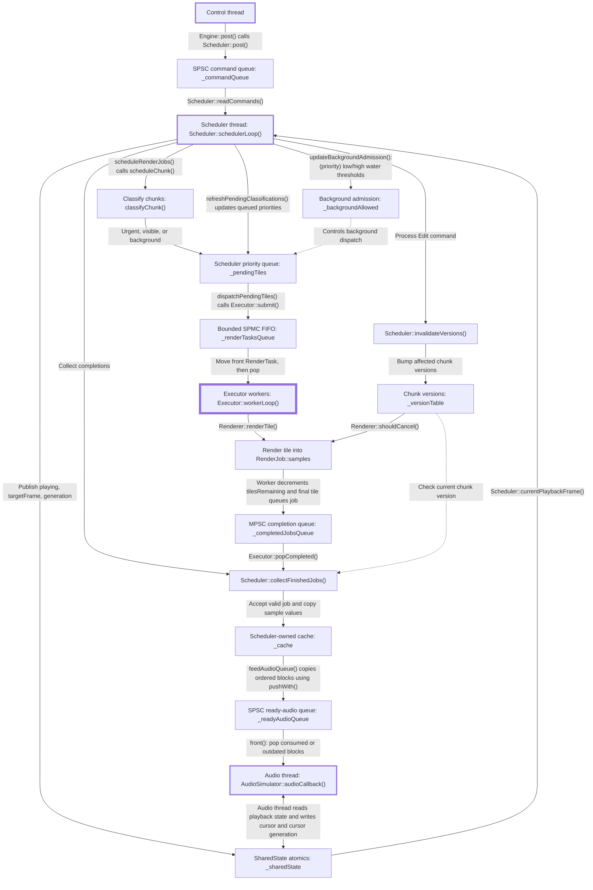

# ANASA - Asynchronous Neural Audio Scheduling Architecture

> Work in progress

A C++ experimental prototype for studying how to schedule computationally expensive audio rendering ahead of playback on a finite audio timeline. It supports DAW-style controls such as play, pause, seek, region edits, and viewport changes.

The prototype uses a simulated periodic audio-device callback. It is not an audio host, plugin, or complete DAW.

The current renderer generates deterministic synthetic audio and artificial CPU load. **It does not yet perform neural inference.**

The problem statement is the following:

Given limited rendering capacity and moving playback deadlines, which work should be rendered first to minimize active-playback underruns and interruption latency while supporting seeks, edits, viewport changes, and background preparation?

The project separates that problem into smaller components:

- A deterministic synthetic renderer that turns timeline tiles into synthetic samples.
- A fixed worker pool that performs render work concurrently.
- A scheduler that classifies, orders, caches, and publishes rendered work.
- Lock-free Single-producer/single-consumer (SPSC) queues. They store commands and ready for consumption audio blocks.
- A simulated audio-device thread that consumes exact blocks and records underruns.
- An `Engine` that owns the complete pipeline and enforces its lifecycle.

Two scheduling strategies are implemented: FIFO ordering by tile submission sequence and deadline-aware priority ordering. Both modes classify work as urgent, visible, or background, and classification affects pending-queue capacity limits. Priority mode also uses low/high water thresholds to gate background dispatch while playback is requested.

## Architecture

ANASA is divided into small **CMake targets** with one-directional dependencies.




### Runtime communication



The diagram shows how commands, rendering work, and audio move between runtime threads. Scheduler coordinates the pipeline. Executor workers render tiles concurrently. AudioSimulator consumes published audio independently. Thicker borders identify threads. The heavier border identifies the Executor worker pool.

- **Command handling:** The control thread posts commands through `_commandQueue`. Scheduler processes them to update playback, viewport, and content state.
- **Work selection:** Scheduler classifies chunks as urgent, visible, or background and places their tiles in `_pendingTiles`. It refreshes classifications when playback or viewport changes require it. In Priority mode, low/high water thresholds control background dispatch while playback is requested.
- **Parallel rendering:** Selected tiles enter the bounded `_renderTasksQueue`. Workers take tasks and render separate regions of a shared `RenderJob::samples` buffer. Once all tile tasks have been accounted for, the final task places the job in `_completedJobsQueue`, even if rendering was cancelled. Jobs abandoned during shutdown may never produce a completion.
- **Completion and publication:** `collectFinishedJobs()` checks job identity, cancellation, and version before copying accepted samples into `_cache`. `feedAudioQueue()` copies cached samples into `_readyAudioQueue` as generation-tagged blocks in timeline order.
- **Audio consumption:** AudioSimulator consumes blocks matching its current generation and expected position, discards outdated blocks, and reports playback progress through `_sharedState`. During active playback, a missing required block records an underrun and advances the simulated cursor through conceptual silence.
- **Transport and invalidation:** Shared atomics communicate playback state, seek targets, generations, and cursor acknowledgements. Edits bump affected chunk versions so Renderer can abandon obsolete work and Scheduler can reject obsolete results.

Rendering may finish out of order, but audio publication remains ordered. Chunk versions identify valid content. Playback generations distinguish audio belonging to different playback sequences.

## Requirements

- CMake 3.22 or newer.
- A compiler and standard library supporting C++20.
- Build tools appropriate for the selected CMake generator:
  - Windows: Visual Studio or Visual Studio Build Tools with the
    "Desktop development with C++" workload.
  - Linux: GCC or Clang, with Make or Ninja.
  - macOS: Xcode Command Line Tools, with Make or Ninja.
- Graphviz, only when regenerating the dependency diagram.

When tests are enabled, CMake downloads Catch2 automatically.
This requires Git and internet access unless `CATCH2_LIB` points
to an existing local Catch2 source checkout. `CATCH2_LIB` is an environment variable, since the CMake root code reads $ENV{CATCH2_LIB}.

## Building and testing

Run these commands from the project root.

### Windows - Visual Studio generator

Configure once with tests enabled:

```powershell
cmake -B build -DBUILD_TESTS=ON -DBENCHMARKS=OFF
```

Build and run tests in **Release**:

```powershell
cmake --build build --config Release
```

and then

```powershell
ctest --test-dir build -C Release --output-on-failure
```

or

```powershell
.\build\tests\Release\tests.exe
```


Or build and run tests in **Debug**:

```powershell
cmake --build build --config Debug
```

and then

```powershell
ctest --test-dir build -C Debug --output-on-failure
```

or

```powershell
.\build\tests\Debug\tests.exe
```

These commands assume CMake selects a Visual Studio generator.

### Linux / macOS - Unix Makefiles or Ninja generator

Use separate build directories for Release and Debug.

Build and run tests in **Release**:

```sh
cmake -B build/release -DCMAKE_BUILD_TYPE=Release -DBUILD_TESTS=ON -DBENCHMARKS=OFF
```

```sh
cmake --build build/release
```

and then

```sh
ctest --test-dir build/release --output-on-failure
```

or

```sh
./build/release/tests/tests
```

Build and run tests in **Debug**:

```sh
cmake -B build/debug -DCMAKE_BUILD_TYPE=Debug -DBUILD_TESTS=ON -DBENCHMARKS=OFF
```

```sh
cmake --build build/debug
```

and then

```sh
ctest --test-dir build/debug --output-on-failure
```

or

```sh
./build/debug/tests/tests
```

### Build options

- `BUILD_TESTS=ON`: build the Catch2 tests.
- `BENCHMARKS=ON`: also enable benchmark cases: requires `BUILD_TESTS=ON`.

To enable benchmarks, replace `-DBENCHMARKS=OFF` with
`-DBENCHMARKS=ON` in the configuration command, then rebuild.
Use Release for performance measurements.

Configuration selection follows the generator: ordinary Ninja on Windows
uses `CMAKE_BUILD_TYPE`. Xcode and Ninja Multi-Config use `--config`.

This project registers Catch2 test cases with CTest in `tests/CMakeLists.txt`:

```cmake
include(Catch)
catch_discover_tests(tests DISCOVERY_MODE PRE_TEST)
```

CTest command works across platforms without needing the executable's precise location, and CTest normally comes with CMake.


## Continuous integration

The GitHub Actions workflow in `.github/workflows/ci.yml` runs:

- On pushes to `main`.
- On pull requests targeting `main`.
- When manually triggered through the repository's Actions tab.

The workflow configures and builds the project in Debug with tests
enabled on Ubuntu and Windows, then runs the registered Catch2 tests
through CTest. Benchmark cases are disabled by default.

Configuration errors, build errors, failing tests, or discovering no
tests cause the corresponding CI job to fail.

Results and logs are available under the **C++ CI** workflow in the
repository's Actions tab.

## Generating the dependency graph

The architecture diagram in `docs/dependencies.svg` shows CMake targets
and their dependencies. Regenerate it after changing targets or their
dependency relationships.

### Install Graphviz

Windows, using Windows Package Manager:

```powershell
winget install graphviz
```

Alternatively, use the Graphviz Windows installer.
Ensure its `bin` directory is on `PATH`, then reopen your terminal.

Ubuntu / Debian:

```sh
sudo apt update
sudo apt install graphviz
```

macOS, using Homebrew:

```sh
brew install graphviz
```

Verify that Graphviz is available:

```sh
dot -V
```

### Windows - PowerShell

Run from the project root:

```powershell
New-Item -ItemType Directory -Force build/dependency-graph | Out-Null

Copy-Item cmake/CMakeGraphVizOptions.cmake build/dependency-graph/CMakeGraphVizOptions.cmake

cmake -B build/dependency-graph -DBUILD_TESTS=ON -DBENCHMARKS=OFF --graphviz=build/dependency-graph/dependencies.dot

dot -Tsvg build/dependency-graph/dependencies.dot -o docs/dependencies.svg
```

### Linux / macOS

Run from the project root:

```sh
mkdir -p build/dependency-graph

cp cmake/CMakeGraphVizOptions.cmake build/dependency-graph/CMakeGraphVizOptions.cmake

cmake -B build/dependency-graph -DBUILD_TESTS=ON -DBENCHMARKS=OFF --graphviz=build/dependency-graph/dependencies.dot

dot -Tsvg build/dependency-graph/dependencies.dot -o docs/dependencies.svg
```

CMake generates the `.dot` dependency description.
Graphviz converts it into the SVG displayed in this README.
Compiling the project is not required.

The copied options file applies the project's graph settings.
These commands include test targets.

Intermediate files remain under `build/dependency-graph/`.
The generated diagram is written to `docs/dependencies.svg`.
